```{r setup, include=FALSE}
options(htmltools.dir.version = FALSE)
```

```{r openMic, include = FALSE, eval = FALSE}
openMic::openMic()
```

class: main

## What is Generative Art? 

### 1950's - Ellsworth Kelly

* Starting in 1951, Kelly created a series of eight pieces titled "Spectrum Colors Arranged by Chance I to VIII". 

--

<figure>
  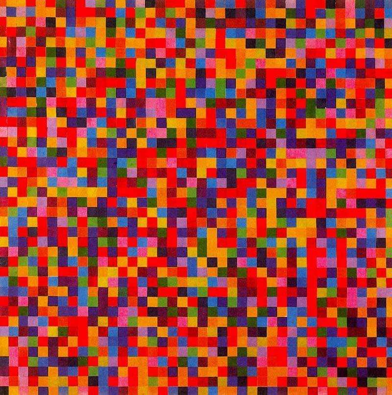
  <figcaption>"Spectrum of Colors Arranged by Chance VI", Kelly</figcaption>
<figure/>

---

class: main

## What is Generative Art? 

### 2021 - Ellsworth Kelly Recreated in R

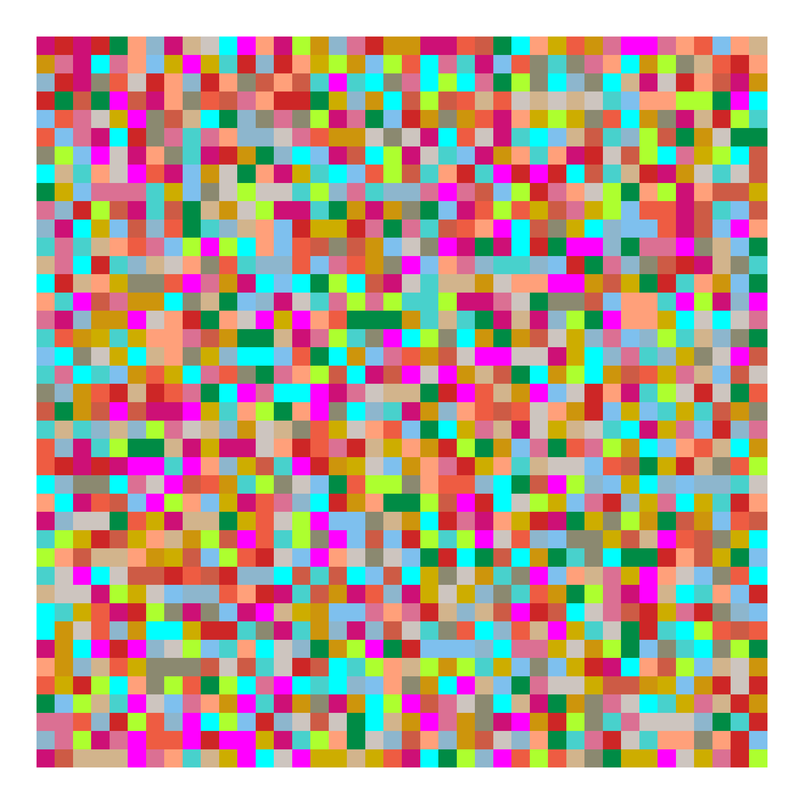

---

class: main

## What is Generative Art? 

### 2021 - Ellsworth Kelly Recreated in R

```{r, eval=FALSE}
# Generate data frame with random values for color
color_data <- sample(1:18, 1600, replace = TRUE)
df <- data.frame(expand.grid(0:39, 0:39))
plot_data <- df %>% 
  mutate(color_data = as.integer(color_data))

# Generate colors
clrs = grDevices::colors()[grep('gr(a|e)y', 
                                grDevices::colors(), 
                                invert = T)]
plot_clrs = sample(clrs, 18)


# Generate Plot
ggplot(plot_data) +
  geom_rect(aes(xmin = Var1, xmax = Var1+1, 
                ymin = Var2, ymax = Var2+1), 
            fill = plot_clrs[color_data])+
  theme_void()
```


---

class: main

## What is Generative Art? 

### 1965 - Georg Nees

* In 1965, *Computergrafik* was the first exhibition world-wide of generative art created with the use of a digital computer.

--

<figure>
  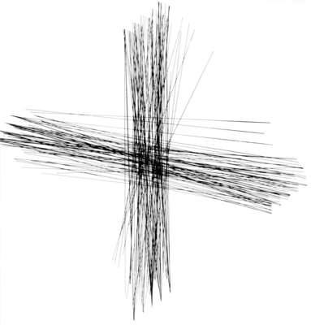
  <figcaption>"Andreaskreuz", Nees</figcaption>
<figure/>

---

class: main

## What is Generative Art? 

### 2003 - Mark Napier

* Napier translated the Old Testament, New Testament and the Koran into binary data and used the stream of 1's and 0's to drive a black and white line on the screen.

--

<figure>
  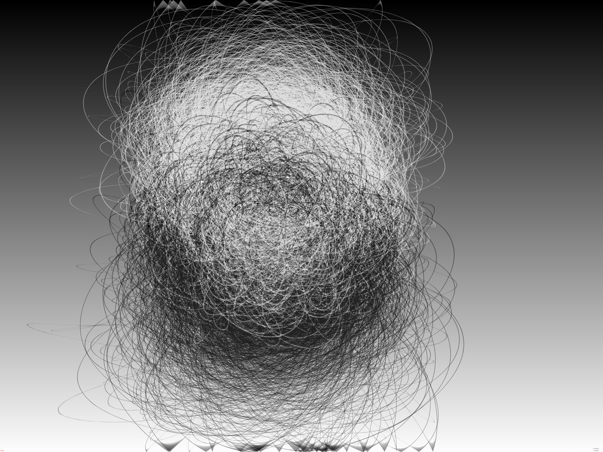
  <figcaption>"Black and White", Napier</figcaption>
<figure/>

---

class: main

## Thomas Lin Pedersen

<a href="https://www.data-imaginist.com/art">
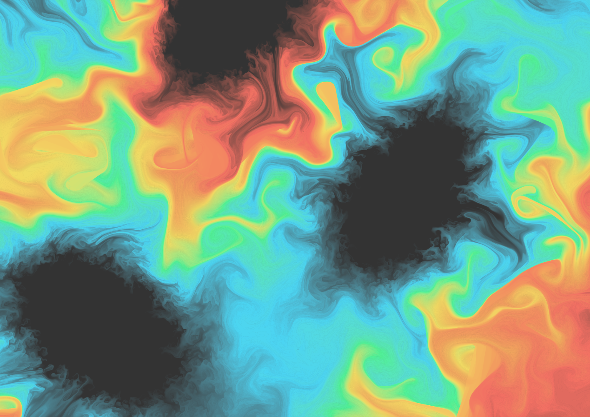
<a/>

I’m a generative artist focusing mainly on exploring the beauty of dynamic systems. For me, the sweet spot of generative art lies in creating a system that you know well enough to set it up for success, but is so complex that you still get surprised when you see the result.

---

class: main

## Danielle Navarro

<a href="https://art.djnavarro.net">

<a/>

---

class: main

## Basics I
### Start with trig functions 

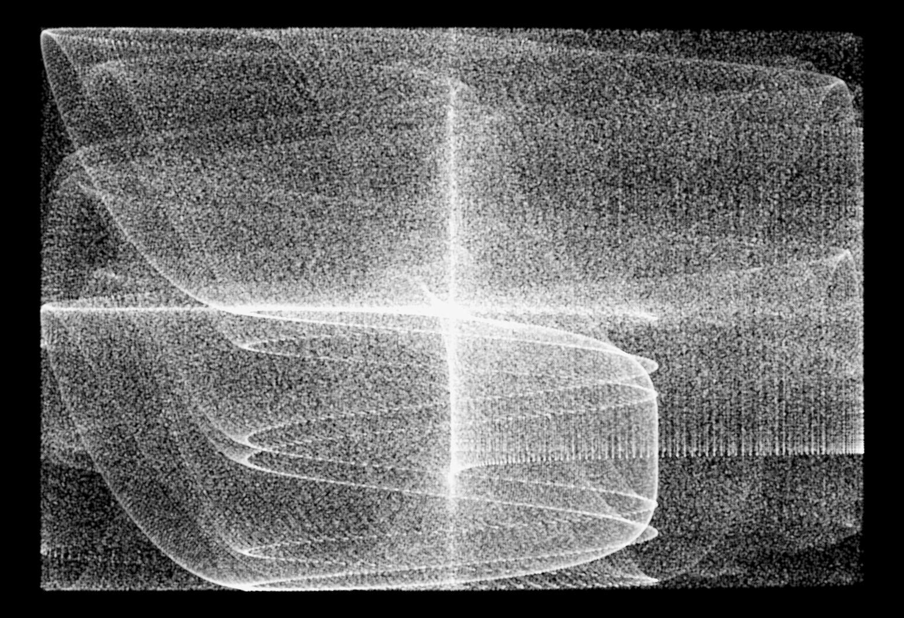

--

$x = 1-sin(x^2)+cos(y^2)$

$y = -cos(y*x^2)-sin(y)$

---

class: main

## Basics II
### Adding polar coordinates

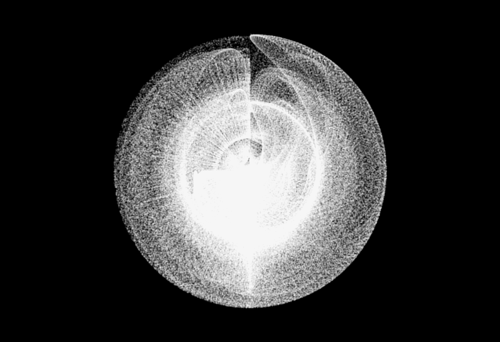

---

class: main

## Basics III
### Adding color

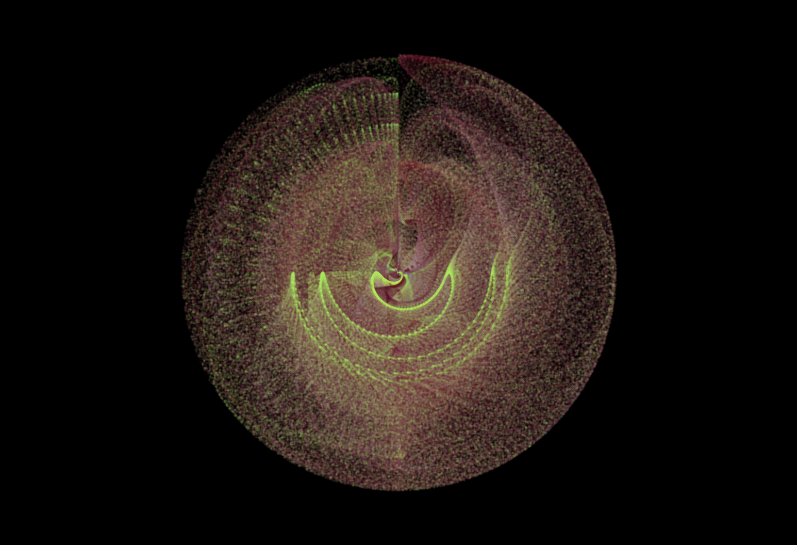

---

class: main

## Non-linear Dynamics: 
### Clifford Attractor

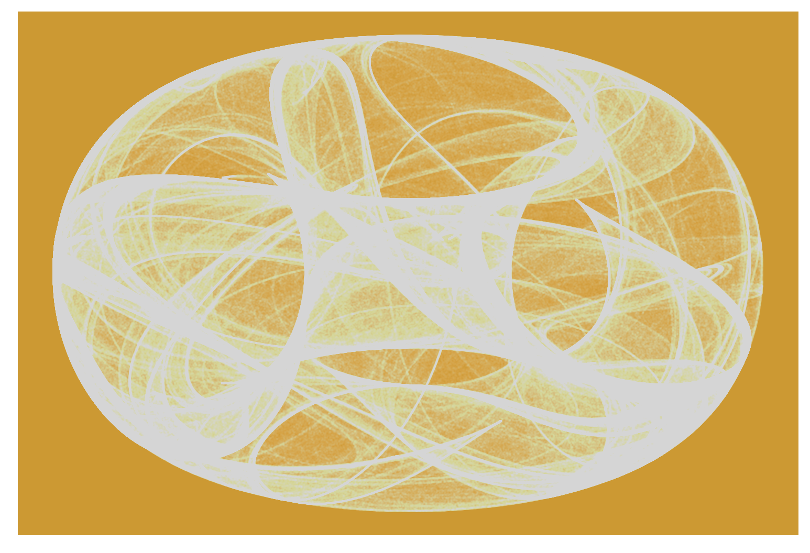

---

class: main

## Non-linear Dynamics: 
### Lorenz Attractor

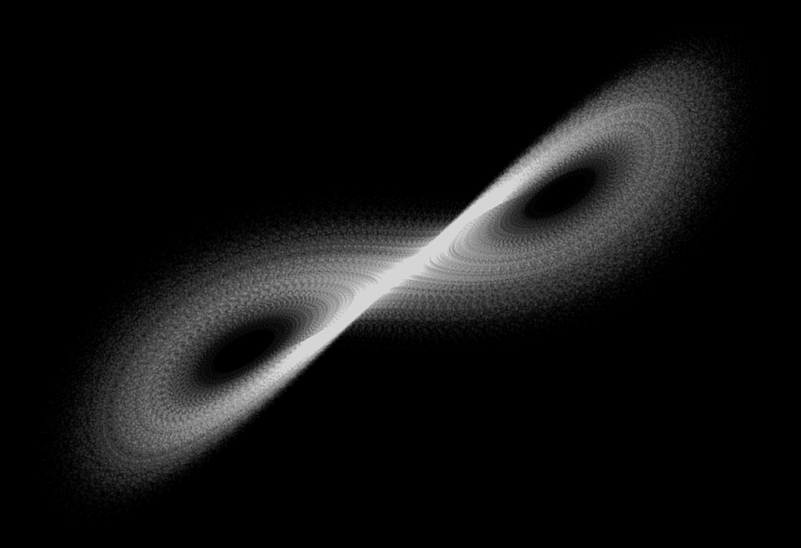

---

class: main

## Non-linear Dynamics: 
### Lorenz Attractor

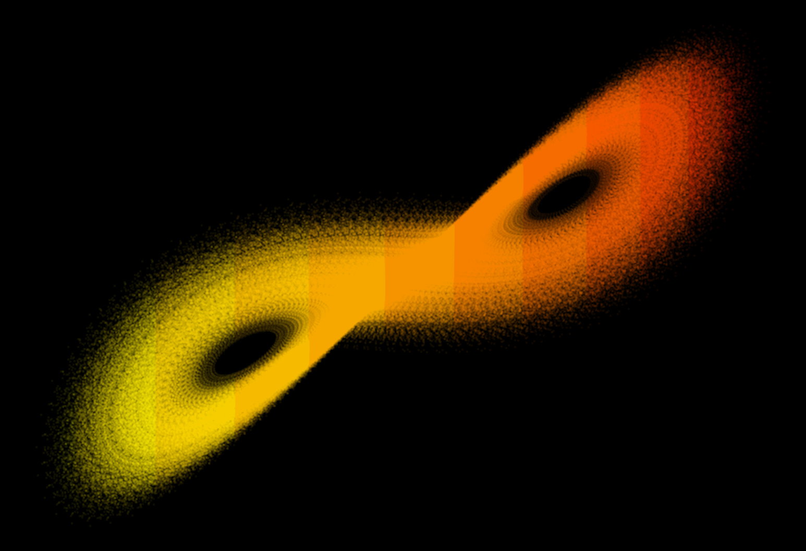

---

class: main

## Non-linear Dynamics: 
### Lorenz Attractor

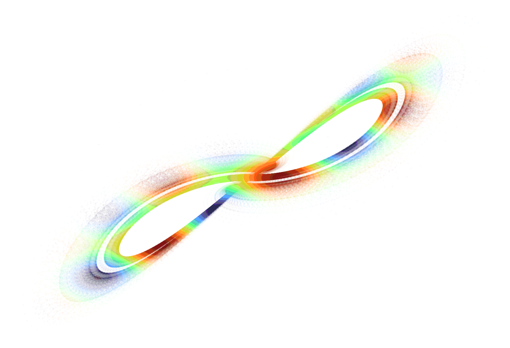

---

class: main

## Jasmines
### A package by Danielle Navarro

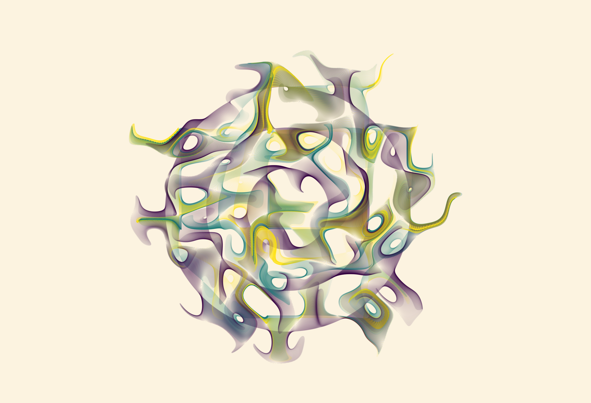

---

class: main

## Flametree
### A package by Danielle Navarro

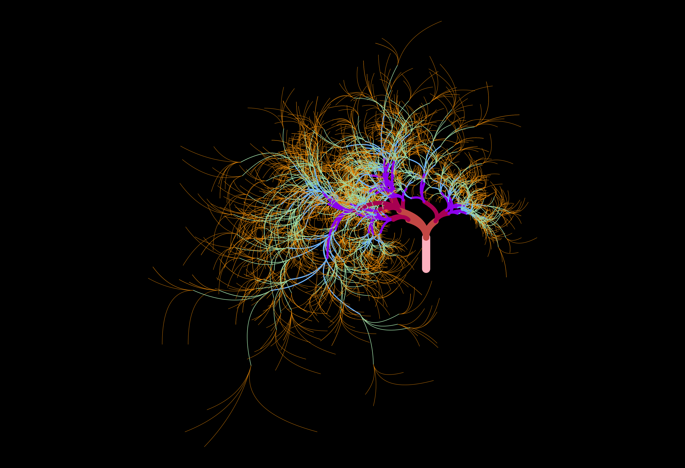

---

class: inverse

# Thank you!

### Slides available at [npaterno.github.io/left_coast_stats](https://npaterno.github.io/left_coast_stats)

### Code available at [github.com/npaterno/generative_art_talk](https://github.com/npaterno/generative_art_talk)

### Questions?