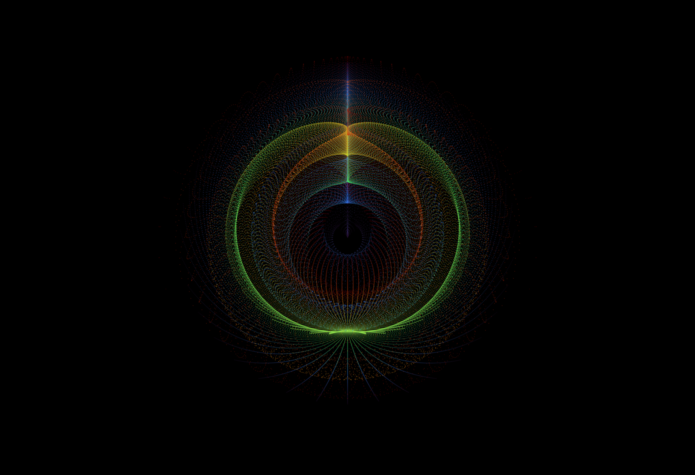

```{r setup, include=FALSE}
options(htmltools.dir.version = FALSE)

library(dplyr)
library(ggplot2)
library(ggdark)
library(jasmines)
library(flametree)
library(Rcpp)
```

```{r openMic, include = FALSE}
openMic::openMic()
```

class: main

## What is Generative Art? 



--

- "Generative art refers to art that in whole or in part has been created with the use of an autonomous system." ~ Wikipedia

--

- "Put very simply, Generative Art is a form of digital art that's generated randomly, whether that's by using autonomous machines or algorithms." ~[Agora Digital Art](https://agoradigital.art/blog-what-is-generative-art/) 

---

class: main

## Thomas Lin Pedersen

<a href="https://www.data-imaginist.com/art">

<a/>

I’m a generative artist focusing mainly on exploring the beauty of dynamic systems. For me, the sweet spot of generative art lies in creating a system that you know well enough to set it up for success, but is so complex that you still get surprised when you see the result.

---

class: main

## Danielle Navarro

<a href="https://art.djnavarro.net">

<a/>

---

class: main

## Basics I
### Using trig functions 

```{r}

```

--- 

class: main

## Basics II
### Adding polar coordinates

```{r}

```

--- 

class: main

## Basics III
### Adding color

```{r}

```

---

class: main

## Non-linear Dynamics: Attractors
### Clifford Attractor

```{r, echo = FALSE}
opt = theme(legend.position  = "none",
            panel.background = element_rect(fill="#87212e"),
            axis.ticks       = element_blank(),
            panel.grid       = element_blank(),
            axis.title       = element_blank(),
            axis.text        = element_blank())

cppFunction('DataFrame createTrajectory(int n, double x0, double y0, 
            double a, double b, double c, double d) {
            // create the columns
            NumericVector x(n);
            NumericVector y(n);
            x[0]=x0;
            y[0]=y0;
            for(int i = 1; i < n; ++i) {
            x[i] = sin(a*y[i-1])+c*cos(a*x[i-1]);
            y[i] = sin(b*x[i-1])+d*cos(b*y[i-1]);
            }
            // return a new data frame
            return DataFrame::create(_["x"]= x, _["y"]= y);
            }
            ')

a=-1.24458046630025
b=-1.25191834103316 
c=1.81590817030519 
d=-1.90866735205054

df=createTrajectory(10000000, 0, 0, a, b, c, d)

ggplot(df, aes(x, y)) + geom_point(color="white", shape=46, alpha=.01) + opt
```

---

class: main

## Non-linear Dynamics: Attractors
### Lorenz Attractor

```{r}

```

---
class: main

## Jasmines
### A package by Danielle Navarro

```{r}

```

---

class: main

## Flametree
### A package by Danielle Navarro

```{r}

```

--- 

{ADD THANK YOU SLIDE}